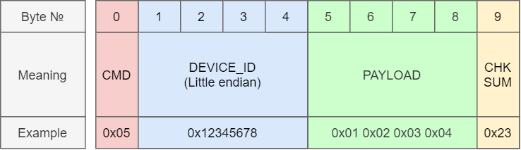

SPL protocol
==========================

This document describes specification of the Open Source single-wire data transmissing protocol for
constrained devices.

### Table of contents
* [Overview](#overview)
* [Hardware layer](#hardware-layer)  
    * [Short length bus](#short-length-bus)
    * [Long length bus](#long-length-bus)
    * [Controlling bus signal](#controlling-bus-signal)
        * [MCU open-drain](#mcu-open-drain)
        * [MCU general-purpose pins](#mcu-general-purpose-pins)
        * [External driver](#external-driver)
* [Data frame layer](#data-frame-layer)
    * [SPL frames](#spl-frames)
        * [Command id](#command-id)
            * [Most significant bit](#most-significant-bit)
            * [Predefined commands](#predefined-commands)
            * [Custom commands](#custom-commands)
        * [Device id](#device-id)
            * [Broadcast address](#broadcast-address)
        * [Payload](#payload)


### Overview
SPL (Originally named after **S**tock**P**i**L**er project) protocol is an open source alternative
for proprietary single-wire interfaces for applications where speed is not a huge priority.

This protocol features the following:
- Single leader device, multiple follower devices. (one to many communication)
- Simple to implement
- Low device requirements (Easily runs even on Padauk™ PMS150C)
- Simple hardware layer (single pull-up resistor)
- Deterministic frame size (10 bytes)
- Simple checksum
- Big device id address space (2^31 addresses)
- Broadcast address
- Pre-defined commands for _ping_ and _sleep_
- Optional acknowledge
- Medium distance (e.g. 3 meters of single ribbon cable wire for 5V CMOS levels should be fine.
  For more long lines more high logic levels may be required to withstand the noise and the voltage
  drop in the wire)

### Hardware layer
Hardware layer is very simple: Single wire + pull-up resistor (For short lines even normal)

#### Short length bus
For application with bus length up to ~50cm single 5k-10k resistor should be sufficient.

For example, we can connect multiple simple devices on the single bus using 3 wires:
* +5V
* GND
* SPL bus signal line


#### Long length bus
If we are talking about 3-4 meter bus and a few dozens of the devices while using 5V CMOS logic,
There are a number of additional considerations that need to be taken into account when long bus
with a few dozens of the devices is required and we have only 5V logic levels at our disposal:

* Because of the potential huge voltage drop in the wires and the signal reflections inside the bus,
  lower pull-down resistors value should be selected. Multiple pull-down resistors may be used, evenly
  distributed throughout all bus length.


#### Controlling bus signal
To only read the bus data, normal input mode can be used on the most MCU's.

However, writing data is more complicated. But do not fear! It is not SO complicated!

##### MCU open-drain
Ideally, If your MCU has open-drain pin (Like PA5 on Padauk PMS150C), it can be used to drive SPL
bus without and hassle, just by toggling MCU pin from 1 to 0 in output mode 


##### MCU general-purpose pins
More dangerous way of controlling the bus (but still, very simple) is to use GPIO pin only in two
modes:
* Input Hi-Z
* Output Low

**CAUTION:** If one device on the bus will set its SPL pin to Output High, while some other device
pull its SPL pin low, it **WILL** cause immediate short circuit condition and damage your devices
on the bus. Please use this mode VERY carefully.


For example, for Arduino, it will translate to something like this:

```c++
void setup() {
  // Pin should be INPUT by default, but let's show that here explicitly anyway
  pinMode(SPL_BUS_PIN, INPUT);
  // Make sure that even when pin mode will be changed to OUTPUT, it will be pulled
  // to ground (sink current)
  digitalWrite(SPL_BUS_PIN, LOW); 
}

// Let's wrap pin control code into separate functions to minimize mistakes and improve
// readability

void spl_pull_down() {
  pinMode(SPL_BUS_PIN, OUTPUT);
}

void spl_pull_up() {
  pinMode(SPL_BUS_PIN, INPUT);
}

// Please note that digitalWrite is only used once, in the setup() function!
// (!!!) This will potentially produce a short circuit: digitalWrite(SPL_BUS_PIN, HIGH); 
```
##### External driver
If it is not possible to guarantee that selected GPIO pin never will be set to active high mode, or
selected pull-up resistors are sourcing more current than GPIO can candle in active log (sink) mode,
then the following two-pin configuration with external N-Channel MOSFET can be used:


Of course, in this case SPL output should be controlled with the inverted signal

### Data frame layer
This chapter describes actual protocol implementation details

#### SPL Frames
SPL protocol frame consists of 10 bytes  
Its layout represents on the following image:  


##### Command id
First byte of the packet represents the command id.

###### Most significant bit

MSB should be set to 1 if acknowledgement command is
required to be sent by receiver. Should be set to 0 for the broadcast commands


###### Predefined commands 
* **0x00, 0x80** - ACK (Acknowledgment): Send by receiver after command was successfully received.
Ignored by receiver. Payload is undefined
* **0x01, 0x81** - PING: Command itself does nothing in 0x01 form, but when
used in 0x81 form, ACK is sent after PING command was successfully received,
therefore PING command allows to check that device is alive.
* **0x02, 0x82** - SLEEP: should be used to put device in the low energy consumption mode. If command
has acknowledgement flag set to 1 (0x82 form), then ACK should be sent by the device BEFORE it goes
to sleep.


###### Custom commands  
Commands 0x03-0x7F (and their ACK complements 0x83-0xFF) are free to use by the user's application.


##### Device id
Device id is unique SPL bus device identifier. When sending command by the device, it should be set
to device's own id; When receiving command, all commands with device id different from device's id
should be skipped. Device ID is represented as **little-endian 32-bit number**

_Example:_

```
# -> Sent by leader to follower device with id 0x00000001
[CMD: 0x85][DEVICE_ID: 0x00000001][PAYLOAD: 0x11223344][CHK: 0x30]

# <- Sent by follower device with id 0x00000001 to leader (ACK command)
[CMD: 0x00][DEVICE_ID: 0x00000001][PAYLOAD: 0x00000000][CHK: 0x01]
```

###### Broadcast address
**Address 0x00000000 is reserved** and can be used by master to send the command to all receivers
simultaneously. (e.g. Enable sleep mode)

Acknowledgement flag in command byte is ignored by the follower devices when broadcast command is
sent

##### Payload
Payload content is completely user-defined. Reserved commands does not encode any data inside
payload

##### Checksum
Checksum byte is calculated using normal sum operation, eg:

```
CMD = 0x85
DEVICE_ID = 0x01, 0x00, 0x00, 0x00
PAYLOAD = 0x11, 0x22, 0x33, 0x44

CHK = byte(0x85 + 0x01 + 0x00 + 0x00 + 0x00 + 0x11 + 0x22 + 0x33 + 0x44)
CHK = byte(0x130)
CHK = 0x30
```